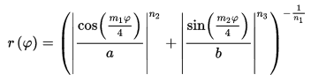

    Bot is currently ONLINE!

__[@superformulabot](https://twitter.com/superformulabot)__ is a generative art Twitter bot by [Jason Webb](https://twitter.com/jasonwebb) that shares drawings created using Johan Gielis' [superformula](https://en.wikipedia.org/wiki/Superformula) equation based on the implementation provided in the book [FORM+CODE](http://formandcode.com/code-examples/visualize-superformula).

Every two hours (+/- up to 15min) a new drawing is automatically generated and tweeted out using parameters based on the current timestamp.

Anyone can request a specific drawing be made for them by @mentioning the bot with a message containing a set of parameters (see [Usage](#usage) and [About the parameters](#about-the-parameters)). The bot will generate a new drawing using the provided parameters, using randomized values for any that are not provided, then reply to the user with the drawing.

If you'd like to play around with the superformula in real-time and see the effects of all the parameters, check out this interactive [Superformula Explorer](https://bl.ocks.org/mbostock/1021103) by Mike Bostock/Christophe Viau.

## Usage 
To request a custom drawing from the bot, __@mention__ it in a tweet containing a list of parameters in the format of `[... {key}:{value} ...]`. For example:

    @superformulabot [a:# b:# m:# n1:# n2:# n3:# iterations:# decay:# invert:#]

All parameters are optional and will be randomized within the ranges below if they are not explicitly provided. Provide as many or as few as you'd like!

* All provided parameters will be automatically clamped to the ranges listed below to limit abuse.
* If no parameters are provided (`[]`), or if anything other than a set of valid key/value pairs are provided (e.g `[schwifty]`), all parameters will be randomized within the ranges below. 
* If a mix of valid parameters and non-valid parameters are provided (e.g. `[m:10 schwifty]`), all valid parameters will be used and all non-valid parameters will be randomized within the ranges below.

All __@mentions__ that do not include at least an empty parameter set (`[]`) will be silently ignored so that people can talk about the bot without triggering it.

## About the parameters
The superformula itself makes use of a number of parameters that you can explicitly provide values for when requesting custom drawings. The formula itself is as follows:

Each of the parameters have distinct effects on the resulting drawing, as described below. In an effort to minimize 'ugly' forms and prevent some abuse, constraints are added to each parameter (see table below). If you think these constraints should be changed, send me a message!

| Parameter | Type      | Description | Range |
|---        |---        |---          |---    |
| `a`       | _float_   | Lateral stretch amount | 0.01 - 8.0 |
| `b`       | _float_   | Vertical stretch amount | 0.01 - 8.0 |
| `m`       | _float_   | Degree of rotational symmetry   _- Positive even integers result in closed shapes, but are not required._ _- When randomized, m will be rounded up to nearest even integer._  | 1.0 - 20.0 |
| `n1`      | _float_   | Affects convexity/concavity of edges, resulting in 'bloated' or 'pinched' shapes | 0.01 - 40.0 |
| `n2`      | _float_   | Similar to n1 | 0.01 - 40.0 |
| `n3`      | _float_   | Similar to n2 | 0.01 - 40.0 |
| `iterations` | _int_  | Number of concentric drawings | 1 - 10 |
| `decay`   | _float_   | Amount of negative change to all parameters per iteration | 0.05 - 0.2 |
| `invert`  | _boolean_ | Invert colors   _- Defaults to `false` for replies for predictability_   _- Changes to `true` for automated tweets overnight (8pm to 6am CST)._ | true \| false |

## Examples

| Status text | Interpreted parameters |
|---              |---                 |
| `@superformulabot [a:1.0 b:1.0 m:3.0 n1:10.0 n2:10.0 n3:10.0 iterations:3 decay:.3 invert:true]` | Exactly as provided |
| `@superformulabot [a:3.0 m:5 n2:3]` | All parameters not provided are randomized (except invert) |
| `@superformulabot []` or `@superformulabot [scwifty]` | All parameters are randomized (except invert) |

## Running continuously with forever
This script is run continuously on an EC2 instance using forever, invoked like so:

    forever -o activity.log -e error.log -c "npm run deploy" start bot.js

You can find out if the script is still running at any point in the future by using:

    forever list

And stop the script using:

    forever stopall

## Technologies used
* [Node.js](https://nodejs.org)
* [Twit](https://github.com/ttezel/twit)
* [moment.js](https://momentjs.com/) and [moment-timezone.js](https://momentjs.com/timezone/)
* [forever](https://github.com/foreverjs/forever)
* [Processing 3.3.6](https://processing.org/) via [CLI](https://github.com/processing/processing/wiki/Command-Line) - _not included in this repo for size reasons_
* [Amazon EC2](https://aws.amazon.com/ec2/)

## References
* [Twitter API and Twitter Bots lesson](http://shiffman.net/a2z/twitter-bots/) from [Daniel Shiffman's Programming A-Z course](http://shiffman.net/a2z/)
* [Coding Challenge #23: 2D Supershapes](https://www.youtube.com/watch?v=ksRoh-10lak) by Dan Shiffman
* [Superformula implementation in Processing](http://formandcode.com/code-examples/visualize-superformula) from FORM+CODE
* [Running Processing without a display wiki page](https://github.com/processing/processing/wiki/Running-without-a-Display)
* [Scott Spencer's Twitter Bot Playground guide](https://spences10.gitbooks.io/twitter-bot-playground/content/)
* [Paul Bourke's article on effects of superformula parameters](http://paulbourke.net/geometry/supershape/)